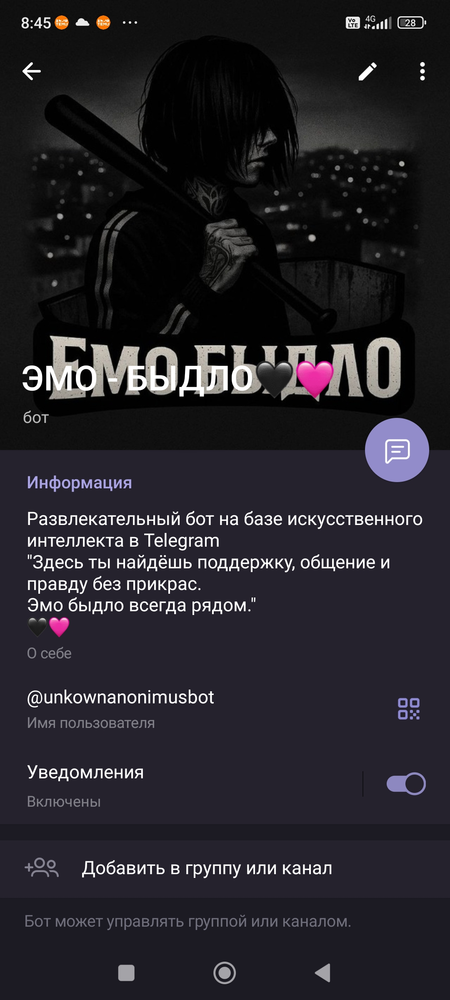
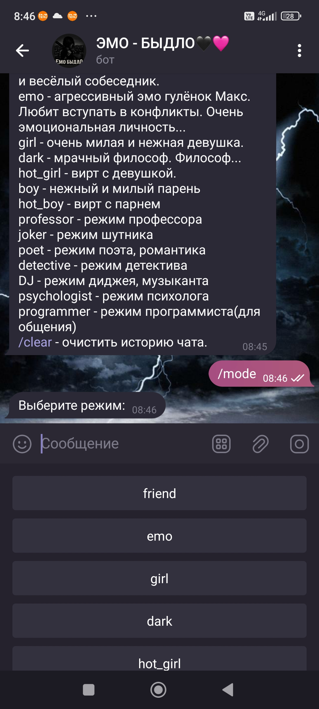
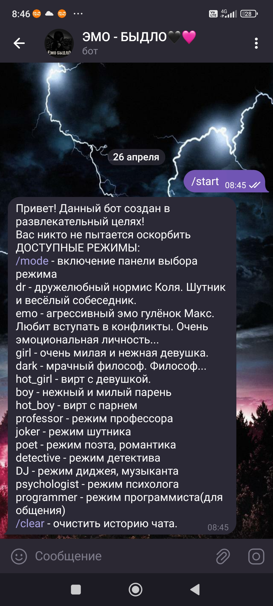

# AI-TG-BOT
Развлекательный бот в телеграме для общения
# Анонимный Telegram-бот с искусственным интеллектом


[Запустить бота](https://t.me/unkownanonimusbot)

## Описание

AI-бот, работающий на Together AI, поддерживает различные роли (друг, эмо, девушка, программист и др.), сохраняет историю чатов и имеет админ-функции.

## Возможности

- Поддержка нескольких режимов общения
- Интеграция с Together AI (Llama-3.3-70B)
- Поддержка истории сообщений
- Админ-команды:
  - /list_chats
  - /get_chat CHAT_ID
- Клавиатура для выбора роли
- Чтение истории чатов

## Скриншоты





## Установка

```bash
git clone https://github.com/zxcWeeJee/AI-TG-BOT.git
cd AI-TG-BOT
pip install -r requirements.txt
cp .env.example .env  # и заполните своими токенами
python bot.py
